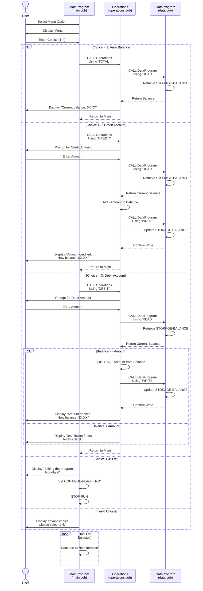

# COBOL Account Management System Documentation

## Overview

This legacy COBOL application implements a Student Account Management System designed to manage student account operations including balance inquiries, credit transactions, and debit transactions. The system follows a modular architecture with separate programs for data management and business operations.

---

## COBOL Files

### 1. **main.cob** - MainProgram

**Purpose:** Entry point and main controller of the Account Management System

**Key Responsibilities:**
- Provides an interactive menu-driven user interface
- Manages the main program loop and user interaction flow
- Orchestrates calls to the Operations program based on user selection
- Handles program termination

**Key Functions:**

| Menu Option | Function | Operation Code Passed |
|-------------|----------|----------------------|
| 1 | View current account balance | `'TOTAL '` |
| 2 | Credit the account | `'CREDIT'` |
| 3 | Debit the account | `'DEBIT '` |
| 4 | Exit the program | N/A |

**Variables:**
- `USER-CHOICE`: Captures user menu selection (numeric 0-9)
- `CONTINUE-FLAG`: Controls the main program loop (YES/NO)

**Flow:**
1. Displays menu options to user
2. Accepts user input
3. Evaluates choice and calls Operations program with appropriate operation code
4. Repeats until user selects exit (option 4)

---

### 2. **data.cob** - DataProgram

**Purpose:** Data persistence layer for student account balance storage

**Key Responsibilities:**
- Maintains the student account balance in persistent storage
- Provides READ and WRITE operations for balance management
- Acts as the single source of truth for account balance data
- Communicates with Operations program via LINKAGE SECTION

**Key Functions:**

| Operation | Functionality |
|-----------|---------------|
| READ | Retrieves current balance from storage |
| WRITE | Updates/persists balance to storage |

**Variables:**
- `STORAGE-BALANCE`: Persistent storage variable holding the current balance (format: 9(6)V99, initial value: 1000.00)
- `OPERATION-TYPE`: Holds the type of operation to perform (READ or WRITE)
- `PASSED-OPERATION`: Linkage variable for receiving operation code
- `BALANCE`: Linkage variable for transferring balance data

**Business Rules:**
- Initial student account balance is **$1,000.00**
- Balance is stored as a numeric value with 2 decimal places
- Balance range: 0.00 to 999,999.99

---

### 3. **operations.cob** - Operations

**Purpose:** Implements business logic for account transactions and balance inquiries

**Key Responsibilities:**
- Processes account operations (balance inquiry, credit, debit)
- Handles user input for transaction amounts
- Implements validation logic (e.g., insufficient funds check)
- Interacts with DataProgram for balance retrieval and persistence
- Displays transaction results to users

**Key Functions:**

| Operation | Description | Validation |
|-----------|-------------|-----------|
| TOTAL | Display current account balance | None |
| CREDIT | Add funds to the account | Amount must be positive |
| DEBIT | Withdraw funds from the account | Balance must be ≥ withdrawal amount |

**Key Business Rules:**

1. **Balance Inquiry (TOTAL)**
   - Retrieves current balance from DataProgram
   - Displays balance to user with formatted message
   - No validation needed

2. **Credit Operation (CREDIT)**
   - Prompts user to enter credit amount
   - Reads current balance from DataProgram
   - Adds amount to current balance
   - Writes updated balance back to DataProgram
   - Confirms transaction and displays new balance

3. **Debit Operation (DEBIT)**
   - Prompts user to enter debit amount
   - Reads current balance from DataProgram
   - **Validation Check**: Verifies sufficient funds (`FINAL-BALANCE >= AMOUNT`)
   - If sufficient funds exist:
     - Subtracts amount from balance
     - Writes updated balance to DataProgram
     - Confirms transaction and displays new balance
   - If insufficient funds:
     - Rejects transaction with error message
     - Balance remains unchanged

**Variables:**
- `OPERATION-TYPE`: Type of operation to perform (TOTAL/CREDIT/DEBIT)
- `AMOUNT`: Transaction amount entered by user
- `FINAL-BALANCE`: Current balance used for calculations
- `PASSED-OPERATION`: Linkage variable for receiving operation code from MainProgram

---

## Business Rules Summary

### Account Operations
- **Starting Balance:** $1,000.00 per student account
- **Account Owner:** Student accounts (implied multi-account capability)
- **Supported Transactions:** Credit (deposit) and Debit (withdrawal)

### Transaction Constraints
- **Debit Transactions:** Cannot exceed current account balance (overdraft protection)
- **Credit Transactions:** No upper limit enforced
- **Balance Precision:** Two decimal places (cents)

### System Behavior
- **Continuous Operation:** Menu loop continues until user explicitly exits
- **Error Handling:** User receives feedback for invalid choices and insufficient funds scenarios
- **State Persistence:** Balance persists across operations within a single program execution

---

## Program Call Hierarchy

```
MainProgram (main.cob)
    ↓
    └─→ Operations (operations.cob)
            ↓
            └─→ DataProgram (data.cob)
```

---

## Data Flow

### Credit Transaction Flow
```
User Input (MainProgram)
    ↓
Operations: Get current balance (READ from DataProgram)
    ↓
Operations: Add credit amount to balance
    ↓
Operations: Write updated balance (WRITE to DataProgram)
    ↓
Display confirmation with new balance
```

### Debit Transaction Flow
```
User Input (MainProgram)
    ↓
Operations: Get current balance (READ from DataProgram)
    ↓
Operations: Validate sufficient funds
    ├─ YES: Subtract debit amount, WRITE to DataProgram
    └─ NO: Display error, balance unchanged
    ↓
Display result (confirmation or error message)
```

---

## Future Modernization Considerations

When modernizing this legacy COBOL system, consider:

1. **Persistent Storage:** Replace in-memory balance with a proper database
2. **Multi-Account Support:** Implement account identification (student ID)
3. **Transaction History:** Add audit trail and transaction logging
4. **Data Validation:** Add comprehensive input validation (amount range, type checks)
5. **Error Handling:** Implement structured exception handling
6. **API Interface:** Replace menu-driven UI with REST API endpoints
7. **Security:** Add authentication and authorization mechanisms
8. **Concurrent Access:** Handle multiple simultaneous user sessions

---

## Notes

- This system is single-user and single-account for a single execution
- All balance changes are temporary within a single program run
- No transaction history or audit trail is maintained
- The modular design (separate programs for data and operations) provides a foundation for future refactoring
---

## Sequence Diagram: Application Data Flow

The following sequence diagram illustrates the complete data flow and interactions between the three COBOL programs for different transaction types:



### Sequence Diagram Legend

- **User**: External actor interacting with the system
- **MainProgram**: Menu controller and entry point
- **Operations**: Business logic processor
- **DataProgram**: Data persistence layer

### Key Observations from the Sequence Diagram

1. **Balance Inquiry (Choice 1)**: Single READ operation to retrieve balance
2. **Credit Operation (Choice 2)**: READ → Calculate → WRITE sequence
3. **Debit Operation (Choice 3)**: READ → Validate → (WRITE or Reject) sequence
4. **Menu Loop**: Continues until user selects exit (Choice 4)
5. **Data Flow**: All balance data flows through DataProgram for consistency
6. **Validation**: Debit operation includes balance validation before write operation